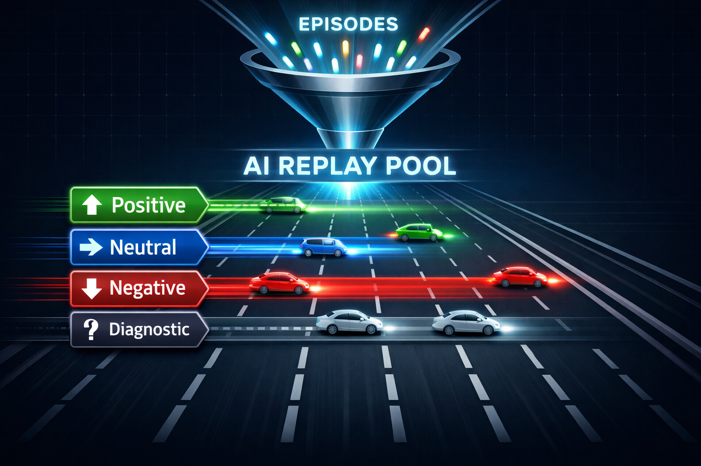
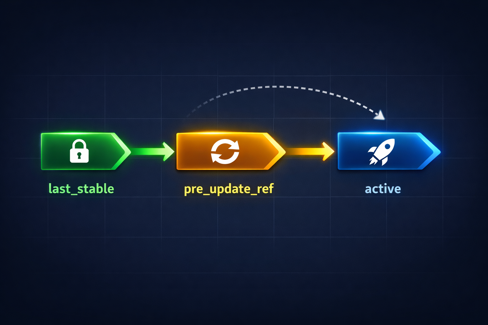
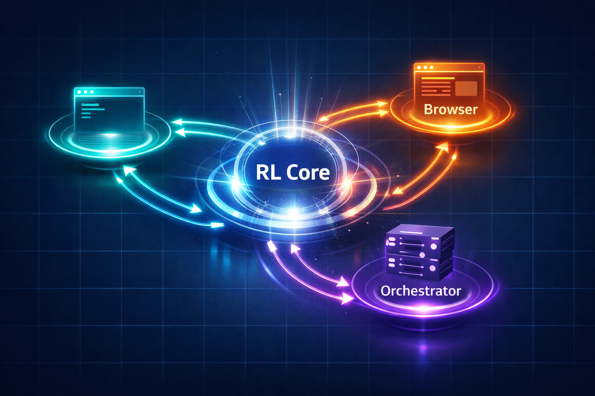

# AIOS RL Training System: 합성 버그픽스에서 멀티 환경 학습까지

`aios orchestrate` 라이브 실행을 출시한 이후, 우리는 그 아래에 더 깊은 시스템을 구축해 왔습니다. shell, 브라우저, 오케스트레이터 작업 전반에서 **하나의 student 정책**을 지속적으로 개선하는 **멀티-환경 강화학습(RL) 시스템**이며, 모든 환경이 단일 통합 트레이닝 컨트롤 플레인을 공유합니다.

이 글은 우리가 무엇을 만들었는지, 왜 그렇게 설계했는지, 그리고 무엇을 가능하게 하는지 설명합니다.



## 환경별 RL을 각각 만들면 생기는 문제

RL 이전에는 시스템에 “student” 가 암묵적인 행동 prior 로 존재했습니다. 스킬 프롬프트, 디스패치 정책, harness 휴리스틱에 녹아 있었고, 새 기능을 추가할 때마다 수동 튜닝이 필요했습니다. “데모에서 된다”에서 “프로덕션에서 안정적”까지의 거리가 길고 수작업이 많아집니다.

자연스러운 다음 단계는 강화학습이지만, 금방 이런 문제가 보입니다.

shell RL / browser RL / orchestrator RL 을 각각 복사해서 별도 컨트롤 플레인으로 만들면, **비슷하지만 호환되지 않는 3개의 RL 구현**이 생깁니다. 그러면:

- 롤백 의미가 환경마다 갈라지고
- 리플레이 라우팅이 비교 불가능해지고
- 체크포인트 lineage 가 시스템 전체가 아니라 환경 단위로 분리되고
- teacher/judge 통합 레이어가 환경마다 늘어나며
- 디버깅이 “왜 브라우저 RL만 다르지?”에 지배됩니다

그래서 올바른 설계는 **공유 컨트롤 플레인을 먼저 추출하고, 환경을 그 위에 연결**하는 방식입니다.

## 아키텍처: 1개의 코어, 3개의 환경

```
scripts/lib/rl-core/           ← 공유 컨트롤 플레인
├── campaign-controller.mjs    ← 수집/모니터링 epoch 오케스트레이션
├── checkpoint-registry.mjs   ← active / pre_update_ref / last_stable lineage
├── comparison-engine.mjs     ← better / same / worse / comparison_failed
├── control-state-store.mjs   ← 재시작 안전한 제어 스냅샷
├── epoch-ledger.mjs           ← epoch 상태 + 성능 저하 연속 추적
├── replay-pool.mjs            ← 4 레인 라우팅(positive/neutral/negative/diagnostic)
├── reward-engine.mjs          ← 환경 reward + teacher shaping 융합
├── teacher-gateway.mjs        ← teacher 출력 정규화(Codex/Claude/Gemini/opencode)
├── schema.mjs                 ← 공유 계약을 여기서 검증
└── trainer.mjs                ← PPO 엔트리포인트(online + offline)

scripts/lib/rl-shell-v1/       ← Shell 환경(합성 버그픽스 태스크)
scripts/lib/rl-browser-v1/      ← Browser 환경(제어된 실제 웹 플로우)
scripts/lib/rl-orchestrator-v1/ ← Orchestrator 환경(제어 결정)
scripts/lib/rl-mixed-v1/       ← 멀티-환경 캠페인
```

`RL Core` 는 공통 학습 컨트롤 플레인을 소유합니다. 에피소드/배치 계약, 비교와 성능 저하 추적, 체크포인트 lineage, 롤백 규칙, 리플레이 라우팅, trainer 엔트리포인트를 정의합니다.

환경 어댑터는 실행에 특화된 것만 담당합니다. 태스크 샘플링, 에피소드 실행, 증거 수집, 환경별 검증 입력 생성 등입니다. RL 로직은 `RL Core` 로 집중합니다.

## 공유 에피소드 계약

shell / browser / orchestrator 어떤 환경이든 동일한 구조로 에피소드를 산출합니다.

```typescript
Episode {
  episodeId: string;
  environment: 'shell' | 'browser' | 'orchestrator';
  taskId: string;
  trajectory: TrajectoryStep[];   // 행동 + 관측
  outcome: 'success' | 'partial' | 'failure' | 'blocked';
  reward: number;
  teacherSignal?: TeacherSignal;  // 실패/경계 에피소드에 부여
  comparison?: ComparisonResult; // 이전 정책 대비
}
```

이 통일성이 있어야 환경 간 비교와 리플레이 라우팅이 의미를 갖습니다.

## 체크포인트 lineage: 3-포인터 모델

```
active ────────────── 현재 사용 중인 정책
  │
  ├── pre_update_ref ── 직전 업데이트 전 스냅샷(롤백 대상)
  │
  └── last_stable ───── 비교로 안정성이 확인된 최신 안정 정책
```

- PPO 업데이트마다 새 `active` 생성
- 업데이트 전 `active` 는 `pre_update_ref` 로 보관
- 다음 비교에서 저하가 확인되면 `pre_update_ref` 로 롤백
- 충분히 안정적이면 `active` 를 `last_stable` 로 승격

온라인 학습을 실용적으로 만드는 “안전한 탐색 + 자동 롤백” 보장입니다.



## 리플레이 풀: 4 레인

모든 에피소드를 무작정 저장하는 대신, 비교 결과로 레인을 결정합니다.

| 레인 | 조건 | 용도 |
|------|------|------|
| `positive` | 이전 정책보다 개선 | PPO + distillation |
| `neutral` | 동일 | 다양성 샘플링 |
| `negative` | 악화 | KL 정규화 타깃 |
| `diagnostic_only` | teacher가 판단한 경계 케이스 | 분석(학습 제외) |

학습된 라우터가 아니라 비교 결과로 결정하므로 단순하고 디버깅이 쉽습니다.



## 멀티-환경 캠페인

가장 강력한 기능은 `rl-mixed-v1` 의 **멀티-환경 캠페인**입니다. 하나의 라이브 배치에 shell + browser + orchestrator 에피소드를 섞을 수 있습니다. 캠페인 컨트롤러는:

1. 환경 비율을 맞춰 태스크 샘플링
2. 에피소드 동시 실행
3. reward 및 비교 결과 집계
4. student 전체에 대해 1회 롤백 결정(환경별이 아님)

즉 shell 버그픽스와 orchestrator 디스패치 결정이 같은 student 를 함께 개선합니다. “엔드투엔드 성공에 도움이 되는가”가 핵심 신호입니다.

## 트레이닝 페이즈

- **Phase 1 (V1)**: teacher shaping 을 사용하는 합성 shell 버그픽스(재현성, 빠른 반복)
- **Phase 2**: 실제 리포지토리 shell 태스크(같은 student 로 더 어려운 분포)
- **Phase 3**: 온라인 모니터링 + promotion(롤백 보호)
- **Phase B**: 브라우저 어댑터(인증벽/폼 제출/스크롤 등 제어된 플로우)
- **Phase C**: 오케스트레이터 어댑터(preflight 게이팅, dispatch 라우팅, 품질 신호 등)
- **Phase D/E**: 멀티-환경 통합 검증

## 무엇이 가능해지나

공유 student 덕분에 다음이 가능해집니다.

- **dispatch 라우팅 개선**: orchestrator 제어 결정으로 “subagent vs dry-run vs human gate”를 학습
- **clarity-gate 오탐 감소**: blocked-checkpoint 에피소드로 “진짜 needs human 신호 vs 노이즈” 구분 학습
- **브라우저 자동화 패턴 강화**: 클릭/스크롤/폼 제출 등 안정적 상호작용 패턴 학습
- **환경 간 학습 공유**: shell 에러 복구가 브라우저에도 전이(같은 student)

## 실행 방법

```bash
# Shell RL: benchmark generation → training → evaluation
node scripts/rl-shell-v1.mjs benchmark-generate --count 20
node scripts/rl-shell-v1.mjs train --epochs 5
node scripts/rl-shell-v1.mjs eval

# Mixed-environment campaign
node scripts/rl-mixed-v1.mjs mixed --browser-only
node scripts/rl-mixed-v1.mjs mixed --orchestrator-only
node scripts/rl-mixed-v1.mjs mixed --mixed

# Evaluate mixed campaign
node scripts/rl-mixed-v1.mjs mixed-eval
```

## 현재 상태

- RL Core: **stable** — 공유 계약 검증, 테스트 통과
- Shell RL V1: **stable** — Phase 1 + 2 구현, Phase 3 진행 중
- Browser RL V1: **beta** — adapter + eval harness 구현
- Orchestrator RL V1: **beta** — adapter + eval harness 구현
- Mixed-environment campaigns: **experimental** — 홀드아웃 태스크로 end-to-end 검증

다음 마일스톤은 **Phase D/E 검증**입니다. 멀티-환경 학습이 단일 환경 학습보다 3 환경의 홀드아웃 태스크에서 더 나은지를 확인합니다.

## 더 읽기

- [AIOS Architecture](/architecture/)
- [RL Core Design Spec](https://github.com/rexleimo/rex-cli/blob/main/docs/superpowers/specs/2026-03-22-aios-rl-core-design.md)
- [Browser + Orchestrator RL Design](https://github.com/rexleimo/rex-cli/blob/main/docs/superpowers/specs/2026-03-23-aios-browser-orchestrator-rl-design.md)
