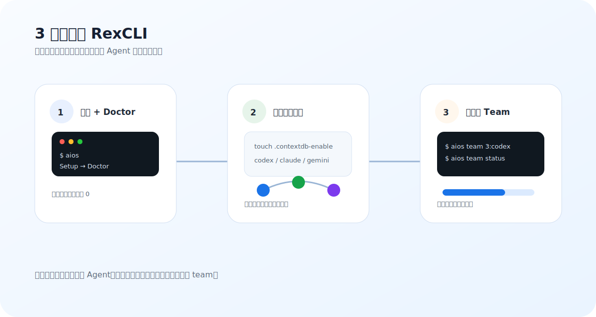

# RexCLI

> Keep your current habits. Add memory, collaboration, and verification to the `codex` / `claude` / `gemini` CLIs you already use.

[3-Minute Quick Start](getting-started.md){ .md-button .md-button--primary data-rex-track="cta_click" data-rex-location="home_hero" data-rex-target="quick_start" }
[How To Use Agent Team](team-ops.md){ .md-button .md-button--primary data-rex-track="cta_click" data-rex-location="home_hero" data-rex-target="team_ops" }
[Find Commands By Scenario](use-cases.md){ .md-button data-rex-track="cta_click" data-rex-location="home_hero" data-rex-target="use_cases" }
[GitHub](https://github.com/rexleimo/rex-cli?utm_source=cli_rexai_top&utm_medium=docs&utm_campaign=en_onboarding&utm_content=home_hero_star){ .md-button data-rex-track="cta_click" data-rex-location="home_hero" data-rex-target="github_star" }

<figure class="rex-visual">
  
  <figcaption>New users should take the shortest path first: install, run Doctor, enable project memory, and only start Agent Team when the task is clearly splittable.</figcaption>
</figure>

## Pick What You Want To Do

| What you want now | Read first | Shortest command |
|---|---|---|
| Install and open the TUI | [Quick Start](getting-started.md) | `aios` |
| Give an agent project memory | [ContextDB](contextdb.md) | `touch .contextdb-enable && codex` |
| Run one agent overnight | [Solo Harness](solo-harness.md) | `aios harness run --objective "Draft tomorrow handoff" --worktree` |
| Run multiple agents together | [Agent Team](team-ops.md) | `aios team 3:codex "Implement X and run tests"` |
| See task progress | [HUD Guide](hud-guide.md) | `aios team status --provider codex --watch` |
| Diagnose browser automation | [Troubleshooting](troubleshooting.md) | `aios internal browser doctor --fix` |

## What RexCLI Is

RexCLI is not another coding agent. It is a local-first capability layer:

1. **Memory layer: ContextDB** - stores events, checkpoints, and context packets inside the current project so work survives terminal restarts.
2. **Workflow layer: Superpowers** - turns vague requests into plans, debugs with evidence, and verifies before completion.
3. **Collaboration layer: Agent Team** - sends clearly separable work to multiple CLI workers and tracks them with HUD.
4. **Tool layer: Browser MCP + Privacy Guard** - lets agents use the browser and redacts sensitive config before sharing.

For long-running single-agent work, [Solo Harness](solo-harness.md) adds run journals, resume/stop controls, and optional worktree isolation on top of ContextDB.

In short: you still run `codex`, `claude`, and `gemini`; RexCLI helps them remember more, coordinate better, and guess less.

## Recommended Path For New Users

### Day 1: Get It Running

```bash
curl -fsSL https://github.com/rexleimo/rex-cli/releases/latest/download/aios-install.sh | bash
source ~/.zshrc
aios
```

In the TUI, choose **Setup**, then run **Doctor**.

### Step 2: Enable Memory In A Project

```bash
cd /path/to/your/project
touch .contextdb-enable
codex
```

From then on, when you start `codex` / `claude` / `gemini` in this project, RexCLI connects them to the same project context.

### Step 3: Use Agent Team Only For Splittable Work

```bash
aios team 3:codex "Refactor the login module and run related tests before finishing"
aios team status --provider codex --watch
```

If the task is still unclear, start with normal interactive `codex` and ask it to analyze first. Use `team` only when the work can be split cleanly.

## Common Misunderstandings

- **Not every task needs Agent Team**: use one agent for single-file fixes, small bugs, or unclear requirements.
- **You do not need every environment variable on day one**: start with the `aios` TUI.
- **Do not start from the feature list**: start from “what do I want to do?” and copy the command.
- **Do not skip Doctor**: run diagnostics before changing install, browser, skills, or native config by hand.

## Next Reads

- [Quick Start](getting-started.md): install, Setup, Doctor, and first run.
- [Find Commands By Scenario](use-cases.md): choose the right entry point by task.
- [Agent Team](team-ops.md): when to use a team, how to monitor it, and how to finish safely.
- [Solo Harness](solo-harness.md): how to let one agent work overnight with status, stop, and resume controls.
- [ContextDB](contextdb.md): how memory persists across sessions.
- [Troubleshooting](troubleshooting.md): install, browser, and live execution issues.
