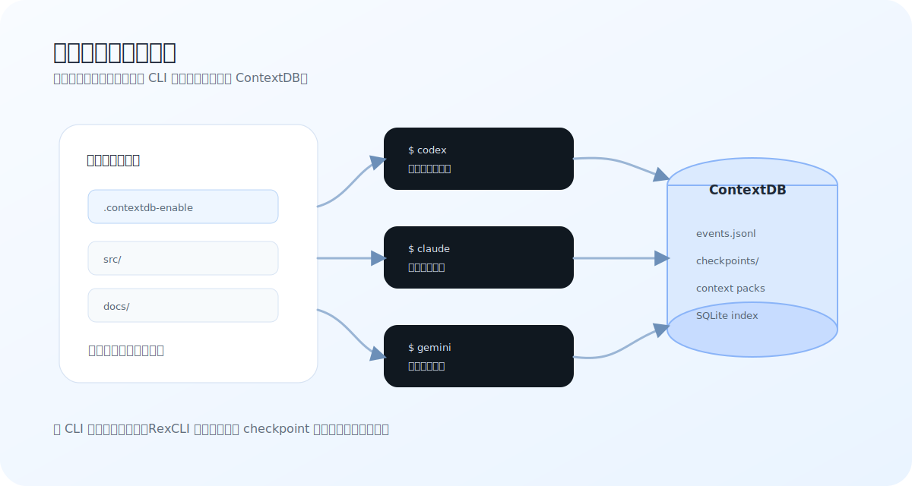

# 시나리오별 명령 찾기

이 페이지는 한 가지 질문에 답합니다: **지금 어떤 명령을 실행해야 하나요?**

<figure class="rex-visual">
  
  <figcaption>대부분의 시나리오는 하나의 핵심을 중심으로 합니다. 프로젝트 루트에서 ContextDB 를 켜면 서로 다른 CLI 가 같은 로컬 컨텍스트에 연결됩니다.</figcaption>
</figure>

## 설치하고 환경을 확인하고 싶어요

```bash
aios
```

TUI 에서 순서대로 실행하세요:

1. **Setup**: shell wrapper, skills, browser 등 구성요소 설치.
2. **Doctor**: Node, MCP, skills, native 설정 확인.
3. **Update**: 이후 업그레이드도 여기서 진행.

명령줄 경로:

```bash
aios setup --components all --mode opt-in --client all
aios doctor --native --verbose
```

## agent 가 현재 프로젝트를 기억하게 하고 싶어요

```bash
cd /path/to/project
touch .contextdb-enable
codex
```

이후 같은 프로젝트에서 `codex`, `claude`, `gemini`, `opencode` 를 실행하면 모두 같은 ContextDB 에 연결됩니다.

## 지속 가능한 운영 메모를 쓰고 싶어요 (Memo + Persona)

CLI 안에서 장기 제약/선호를 빠르게 관리하려면 `aios memo`를 사용하세요:

```bash
aios memo use release-train
aios memo add "Need strict pre-PR checks #quality"
aios memo pin add "Avoid destructive git commands."
aios memo recall "quality gate" --limit 5
aios memo persona add "Response style: concise, direct, evidence-first"
aios memo user add "Preferred language: zh-CN + technical English terms"
```

메모 계층 규칙:

- `memo add/list/search/recall` -> ContextDB 이벤트 레이어
- `memo pin` -> 워크스페이스 pinned 파일
- `memo persona/user` -> `ctx-agent` Memory prelude 에 주입되는 전역 identity 파일

Persona 는 agent baseline ("이 AI 가 어떻게 행동해야 하는가") 용도입니다. User profile 은 안정적인 operator preference ("이 사용자가 어떤 방식의 납품을 원하는가") 용도입니다. 둘 다 주입 전에 안전 스캔과 용량 제한을 거칩니다.

## CLI 를 바꿔가며 이어받고 싶어요

```bash
claude   # 먼저 분석
codex    # 다음 구현
gemini   # 마지막 검토 또는 비교
```

모두 같은 프로젝트 디렉터리에서 실행하면 ContextDB 가 이벤트와 checkpoint 를 저장해, 도구를 바꿔도 컨텍스트를 잃을 가능성을 줄입니다.

## 한 agent 를 밤새 계속 돌리고 싶어요

적합: 목표가 명확하고, provider 하나면 충분하고, 야간에 계속 진행시키고 싶으며, 병렬 worker 가 필요하지 않을 때.

```bash
aios harness run --objective "내일 아침 인계 메모 정리" --session nightly-demo --worktree --max-iterations 20
aios harness status --session nightly-demo --json
aios hud --session nightly-demo --json
```

안전한 경계에서 멈추게 하거나 나중에 이어서 실행하려면:

```bash
aios harness stop --session nightly-demo --reason "아침에 사람이 인계"
aios harness resume --session nightly-demo
```

hooks 증거를 제어하려면 명시적으로 지정하세요:

```bash
aios harness run --objective "내일 아침 인계 메모 정리" --session nightly-demo --hooks
aios harness resume --session nightly-demo --no-hooks
```

“한 agent 가 한 목표를 계속 밀어붙이게” 하고 싶다면 [솔로 Harness](solo-harness.md) 를 사용하세요. 작업이 정말 병렬 친화적일 때만 [Agent Team](team-ops.md) 을 쓰면 됩니다.

팁: 래핑된 `codex` / `claude` / `gemini` / `opencode` 에서 시작하고 야간/재개 가능 작업을 명시하면, 시작 route prompt 가 agent 에게 같은 `aios harness run ... --workspace <project-root>` 명령을 자체 트리거하도록 안내합니다. 사용자가 직접 외울 필요가 없습니다.

## Agent Team 을 켜고 싶어요

적합: 모듈이 독립적이고, 작업을 나눌 수 있으며, token 비용을 감수할 수 있을 때.

```bash
# Dry-run preview (안전, 모델 호출 없음)
aios team 3:codex "X 구현, 완료 전 테스트 실행, 변경 요약"

# 라이브 GroupChat 실행 (라운드 기반, 공유 대화)
AIOS_EXECUTE_LIVE=1 AIOS_SUBAGENT_CLIENT=codex-cli aios team 3:codex "X 구현"

# 진행 상황 모니터링
aios team status --provider codex --watch
```

라이브 모드에서 Agent Team 은 **GroupChat Runtime** 을 사용합니다. 에이전트가 공유 대화 스레드로 라운드 기반 실행을 하며, planner 가 작업을 분석하고 implementer 들이 라운드별로 병렬 작업한 뒤 reviewer 가 검증합니다. 막힌 에이전트는 자동으로 re-plan 라운드를 트리거합니다.

부적합: 요구가 모호함, 단일 bug, 여러 worker 가 같은 파일을 수정할 가능성이 높음. 이때는 일반 `codex` 부터 시작하세요.

## 진행 상황과 기록을 보고 싶어요

```bash
aios hud --provider codex
aios team status --provider codex --watch
aios team history --provider codex --limit 20
```

최근 실패만 빠르게 보려면:

```bash
aios team history --provider codex --quality-failed-only
```

## quality gate 를 실행하고 싶어요

```bash
aios quality-gate pre-pr --profile strict
```

PR 전 또는 큰 변경 후 실행하세요. ContextDB, native/sync, release health 확인을 포함합니다.

RL 릴리스 게이트 상태와 추세를 직접 보고 싶다면:

```bash
aios release-status --recent 12
aios release-status --strict
```

## RexCLI 에 단계별 orchestration 을 맡기고 싶어요

먼저 model call 없이 preview:

```bash
aios orchestrate feature --task "Ship X" --dispatch local --execute dry-run
```

live 실행이 필요할 때만 명시적으로 활성화:

```bash
export AIOS_EXECUTE_LIVE=1
export AIOS_SUBAGENT_CLIENT=codex-cli
aios orchestrate --session <session-id> --dispatch local --execute live
```

새 사용자는 `aios team ...` 을 우선 사용하세요. `orchestrate live` 는 session, plan, preflight gate 를 이미 이해한 메인테이너에게 더 적합합니다.

집중된 단일 변경 작업에는 `bugfix` blueprint (3라운드: plan → implement → review) 를 사용하세요:

```bash
AIOS_EXECUTE_LIVE=1 AIOS_SUBAGENT_CLIENT=codex-cli \
  aios orchestrate bugfix --task "Fix X" --execute live --preflight none
```

## 브라우저 자동화를 진단하고 싶어요

```bash
aios internal browser doctor --fix
aios internal browser cdp-status
```

페이지 작업이 실패하면 전체를 다시 설치하기 전에 [문제 해결](troubleshooting.md)을 확인하세요.

## secrets 와 config 를 보호하고 싶어요

```bash
aios privacy read --file .env
```

`.env`, cookies, tokens, browser profiles 를 model 에 그대로 붙여 넣지 마세요. RexCLI Privacy Guard 는 read output 을 공유하기 전에 마스킹하려고 합니다.

## 선택 기준

- **일상 개발**: `codex` / `claude` / `gemini` / `opencode`
- **설치/업데이트**: `aios`
- **솔로 야간 실행**: `aios harness run --objective "내일 아침 인계 메모 정리" --worktree`
- **Agent Team (GroupChat)**: `aios team 3:codex "task"` (라운드 기반 공유 대화)
- **진행 상황**: `aios team status --watch`
- **전달 전**: `aios quality-gate pre-pr --profile strict`
- **브라우저 문제**: `aios internal browser doctor --fix`
