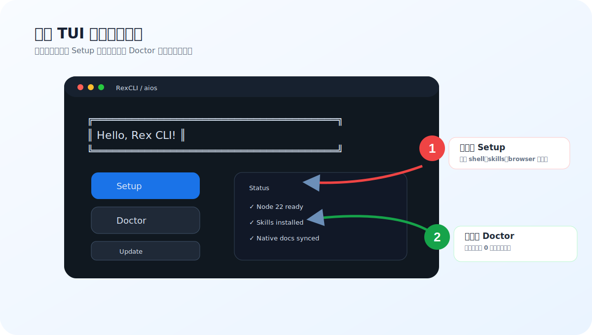

# 快速开始

目标：**先在 3 分钟内装好、打开 TUI、跑一次 Doctor、在项目里启动 agent。**

如果你还不知道 RexCLI 的所有功能，没关系。先按本页走一遍，后面再看 [按场景找命令](use-cases.md)。

## 你需要准备什么

- Node.js **22 LTS** 和 `npm`
- 至少一个 coding CLI：`codex`、`claude` 或 `gemini`
- 一个你要工作的项目目录

检查 Node：

```bash
node -v
npm -v
```

如果 Node 不是 22，建议先切换：

```bash
nvm install 22
nvm use 22
```

## 1) 安装稳定版

=== "macOS / Linux"

    ```bash
    curl -fsSL https://github.com/rexleimo/rex-cli/releases/latest/download/aios-install.sh | bash
    source ~/.zshrc
    aios
    ```

    如果你使用 bash 而不是 zsh，把 `source ~/.zshrc` 换成 `source ~/.bashrc`。

=== "Windows PowerShell"

    ```powershell
    irm https://github.com/rexleimo/rex-cli/releases/latest/download/aios-install.ps1 | iex
    . $PROFILE
    aios
    ```

安装后默认目录是 `~/.rexcil/rex-cli`，统一入口是 `aios`。

!!! tip "什么时候用 git clone？"
    只有你明确想跟随 `main` 分支的未发布行为时，才用 `git clone`。稳定用户优先用 GitHub Releases 安装。

## 2) 在 TUI 里完成 Setup 和 Doctor

运行：

```bash
aios
```

推荐顺序：

1. 选择 **Setup**。
2. 组件先选 `all`，或最小选择 `shell,skills,superpowers`。
3. 安装完成后选择 **Doctor**。
4. Doctor 没有关键错误后再开始使用。

<figure class="rex-visual">
  
  <figcaption>示意图：TUI 打开后先做 Setup，再做 Doctor。关键错误为 0 后，再进入项目里启动 `codex` / `claude` / `gemini`。</figcaption>
</figure>

如果你改了 shell 包装层，重新加载当前 shell：

=== "macOS / Linux"

    ```bash
    source ~/.zshrc
    ```

=== "Windows PowerShell"

    ```powershell
    . $PROFILE
    ```

## 3) 在项目里启用记忆

进入你的项目目录：

=== "macOS / Linux"

    ```bash
    cd /path/to/your/project
    touch .contextdb-enable
    codex
    ```

=== "Windows PowerShell"

    ```powershell
    cd C:\path\to\your\project
    New-Item -ItemType File -Path .contextdb-enable -Force
    codex
    ```

你也可以把最后一行换成：

```bash
claude
gemini
```

只要在同一项目目录里，它们都会读写同一个 ContextDB。

## 4) 第一次确认是否生效

在项目里运行：

=== "macOS / Linux"

    ```bash
    aios doctor --native --verbose
    ls -la memory/context-db
    ```

=== "Windows PowerShell"

    ```powershell
    aios doctor --native --verbose
    Get-ChildItem -Path memory/context-db -ErrorAction SilentlyContinue
    ```

看到 `sessions/`、`index/` 或 `exports/` 这类目录，说明 ContextDB 已经开始记录。

如果目录还不存在，先正常启动一次 `codex` / `claude` / `gemini`，让 RexCLI 自动初始化；不需要立刻重装。

如果没有看到，不要急着重装，先跑：

```bash
aios doctor --native --fix
```

## 5) 最常用的 6 条命令

| 场景 | 命令 |
|---|---|
| 打开 TUI | `aios` |
| 启动带记忆的 Codex | `codex` |
| 查看当前会话状态 | `aios hud --provider codex` |
| 多 agent 执行任务 | `aios team 3:codex "实现 X，并在完成前跑测试"` |
| 监控 team 进度 | `aios team status --provider codex --watch` |
| 提交前质量检查 | `aios quality-gate pre-pr --profile strict` |

## 6) 用 Memo 管理持续记忆

如果你想要可持续的项目笔记，但不想手动改 ContextDB 文件：

```bash
aios memo use release-train
aios memo add "Need strict pre-PR checks #quality"
aios memo pin add "Avoid destructive git commands."
aios memo recall "quality gate" --limit 5
```

记忆分层：

- `memo add/list/search/recall` -> ContextDB 事件层
- `memo pin` -> 工作区 `pinned.md`
- `memo persona/user` -> 全局身份文件（`~/.aios/SOUL.md`、`~/.aios/USER.md`）

## 7) 多 Agent 的最短用法

当任务能拆成多个相对独立的部分时再用：

```bash
aios team 3:codex "实现用户设置页、补测试、更新文档"
aios team status --provider codex --watch
```

如果你只是修一个小 bug，或者还不知道要怎么拆，先普通启动：

```bash
codex
```

更多判断标准看 [多 Agent 实战](team-ops.md)。

## 8) 浏览器自动化先这样排查

RexCLI 默认使用 CDP/browser-use 路线做浏览器自动化。出现浏览器相关问题先跑：

```bash
aios internal browser doctor --fix
aios internal browser cdp-status
```

复杂页面操作时，优先让 agent 读取页面文本/DOM，再截图；不要一开始就盲点按钮。

## 9) 隐私读取

读取 `.env`、token、cookies、云服务配置时，不要直接贴给模型。用：

```bash
aios privacy read --file <path>
```

启动被 RexCLI 包装的 `codex` / `claude` / `gemini` 时，会出现 Privacy Shield 提示，说明当前隐私保护状态。

## 10) 更新和卸载

优先走 TUI：

```bash
aios
```

也可以命令行执行：

```bash
aios update --components all --client all
aios uninstall --components shell,skills,native
```

## 11) 开发安装路径

维护者或想测试未发布功能时使用：

=== "macOS / Linux"

    ```bash
    git clone https://github.com/rexleimo/rex-cli.git ~/.rexcil/rex-cli
    cd ~/.rexcil/rex-cli
    scripts/aios.sh
    ```

=== "Windows PowerShell"

    ```powershell
    git clone https://github.com/rexleimo/rex-cli.git $HOME\.rexcil\rex-cli
    cd $HOME\.rexcil\rex-cli
    powershell -ExecutionPolicy Bypass -File .\scripts\aios.ps1
    ```

开发安装不等同于稳定 release。普通用户建议使用第 1 步的一条命令安装。

## 常见问答

### RexCLI 会替代原生 CLI 吗？

不会。你仍然运行 `codex`、`claude`、`gemini`。RexCLI 只是在启动前后补上记忆、技能、诊断和编排能力。

### 为什么要创建 `.contextdb-enable`？

这是 opt-in 开关，避免 RexCLI 在所有目录里都记录上下文。只在你愿意启用项目记忆的仓库创建它。

### 我需要先学完 ContextDB / Superpowers / Team Ops 吗？

不需要。新用户先会三件事就够：`aios` 安装诊断、`.contextdb-enable` 启用项目、`codex` 正常工作。

### 多 Agent 默认开几个？

推荐从 `3` 开始：

```bash
aios team 3:codex "任务"
```

如果冲突变多，降到 `2`；如果任务很独立，再考虑 `4`。

### `CODEX_HOME points to ".codex"` 怎么办？

说明 `CODEX_HOME` 是相对路径，改成绝对路径：

```bash
export CODEX_HOME="$HOME/.codex"
mkdir -p "$CODEX_HOME"
```

### 下一页看什么？

- [按场景找命令](use-cases.md)
- [多 Agent 实战](team-ops.md)
- [ContextDB](contextdb.md)
- [故障排查](troubleshooting.md)
