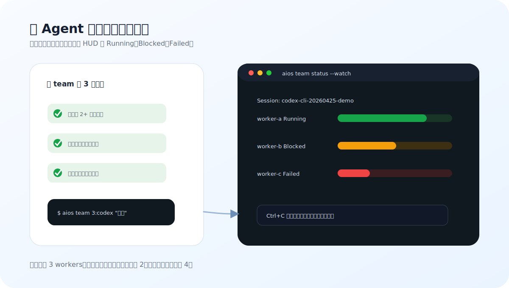

# 多 Agent 实战

Agent Team 不是”越多越好”。它适合**能拆分、边界清楚、允许并行**的任务。

在 live 模式下，Agent Team 使用 **GroupChat Runtime**：agent 在轮次中运行，共享同一个对话线程。Planner 分析任务，implementer 并行工作，reviewer 验证。如果某个 agent 被阻塞，将自动触发 re-plan 轮次。

如果你只想记一条命令：

```bash
aios team 3:codex "实现 X，完成前运行测试并总结改动"
aios team status --provider codex --watch
```

<figure class="rex-visual">
  
  <figcaption>先检查任务是否真的适合并行，再启动 team；监控窗口只负责看进度，关闭监控不等于停止主任务。</figcaption>
</figure>

## 什么时候该用 team

适合用：

- 一个需求能拆成前端、后端、测试、文档等相对独立部分。
- 你已经知道验收标准，比如“测试必须通过”“文档要更新”。
- 你愿意为并行执行支付更多 token 和等待成本。
- 你需要 HUD/历史记录来追踪多个 worker。

不适合用：

- 需求还没想清楚，只是在探索方向。
- 小 bug、单文件修复、一次性命令。
- 多个 worker 大概率会改同一个文件。
- 你正在调试一个需要稳定复现的问题。

不确定时，先用普通交互式：

```bash
codex
```

开 team 前建议先确认这 3 项：

<div class="rex-checklist">
  <div class="rex-checklist__item">能拆成 2 个以上独立模块</div>
  <div class="rex-checklist__item">多个 worker 不会改同一批文件</div>
  <div class="rex-checklist__item">验收标准能一句话说清</div>
</div>

## 10 分钟跑通流程

### 1) 写清楚任务

好的任务描述要包含三件事：目标、边界、验收。

```bash
aios team 3:codex "优化登录页表单错误提示；不要改认证 API；完成前运行相关测试并更新中文文档"
```

### 2) 开始监控

```bash
aios team status --provider codex --watch
```

常用轻量模式：

```bash
aios team status --provider codex --watch --preset minimal --fast
```

### 3) 看历史和失败

```bash
aios team history --provider codex --limit 20
aios team history --provider codex --quality-failed-only
```

### 4) 收尾前做质量门禁

```bash
aios quality-gate pre-pr --profile strict
```

如果 quality gate 失败，先看失败分类，不要直接再次开更多 worker。

## worker 数怎么选

| 档位 | 命令 | 适合场景 |
|---|---|---|
| 稳定 | `aios team 2:codex "任务"` | 文件可能有交叉、第一次跑 |
| 推荐 | `aios team 3:codex "任务"` | 大多数日常功能 |
| 高吞吐 | `aios team 4:codex "任务"` | 模块很独立、测试足够清楚 |

如果出现冲突、重复修改、等待过久，先降并发，不要继续加 worker。

## provider 怎么选

```bash
aios team 3:codex "任务"
aios team 2:claude "任务"
aios team 2:gemini "任务" --dry-run
```

建议：

- 日常实现优先 `codex`。
- 需要长文分析或方案对比时可以试 `claude`。
- 不确定命令效果时先加 `--dry-run`。

## resume 和重试

如果某次运行中断，先看历史：

```bash
aios team history --provider codex --limit 5
```

然后只重试 blocked job：

```bash
aios team --resume <session-id> --retry-blocked --provider codex --workers 2
```

不要在不了解失败原因时直接重新开一个更大的 team。

## HUD 看什么

```bash
aios hud --provider codex
aios hud --watch --preset focused
aios hud --session <session-id> --json
```

重点看：

- 当前 session 是否还活着。
- dispatch jobs 是否 blocked。
- quality-gate 是否失败。
- 是否有可用的 skill candidate 建议。

## skill candidates 什么时候看

失败复盘时再看，不是新手第一步。

```bash
aios team status --show-skill-candidates
aios team skill-candidates list --session <session-id>
aios team skill-candidates export --session <session-id> --output ./candidate.patch.md
```

应用前必须人工审查补丁，尤其是会改 skills、hooks、MCP 配置的建议。

## team 和 orchestrate 的区别

| 能力 | 更适合 |
|---|---|
| `aios team ...` | 想快速开多个 worker 做一个任务 |
| `aios orchestrate ... --execute dry-run` | 想先看阶段 DAG 和门禁 |
| `aios orchestrate ... --execute live` | 维护者需要严格分阶段执行 |

新用户优先用 `team`。`orchestrate live` 需要显式 opt-in：

```bash
export AIOS_EXECUTE_LIVE=1
export AIOS_SUBAGENT_CLIENT=codex-cli
aios orchestrate --session <session-id> --dispatch local --execute live
```

## GroupChat Runtime（基于轮次的 Agent Team）

当 `aios team` 在 live 模式下运行时，它使用 **GroupChat Runtime**：一种基于轮次的执行模型，agent 共享同一个对话线程，而非在隔离的单次 dispatch 中工作。

### 与传统并行 Dispatch 的区别

| | 传统并行 | GroupChat Runtime |
|---|---|---|
| Agent 通信 | 隔离；仅依赖输出 | 共享对话历史 |
| 执行顺序 | 静态 DAG 阶段 | 轮次（顺序），每轮内并行 speaker |
| 阻塞恢复 | 手动重试 | 自动 re-plan（planner 重新评估） |
| 工作项扩展 | 固定队列 | Planner 发现项变为并行工作项 |
| 终止条件 | 所有 job 完成 | 共识或达到最大轮次 |

### 轮次流程

GroupChat 将 blueprint 的阶段映射为轮次。每轮内，speaker 并发运行（由 `AIOS_SUBAGENT_CONCURRENCY` 控制）。一轮结束后，下一轮的所有 agent 可以看到完整的累积历史。

```
Round 1 → planner（分析，产出工作项）
Round 2 → N × implementer（并行，每个工作项一个）
Round 3 → reviewer（+ security-reviewer 并行）
```

如果某个 implementer 报告 `blocked` 或 `needs-input`，将自动插入 **re-plan 轮次**：planner 在拥有完整历史可见性的情况下重新评估情况，并决定下一步。

### Blueprint 选择

| Blueprint | 轮次 | 最适合 |
|---|---|---|
| `bugfix` | plan → implement → review | 单点修复，小范围 |
| `feature` | plan → implement → review + security | 带质量门禁的新功能 |
| `refactor` | plan → implement → review | 纯重构，无功能变更 |
| `security` | assess → plan → implement → review | 安全敏感变更 |

选择能覆盖任务的最小 blueprint。简单的文件创建用 `bugfix`，不需要 `feature`。

### 配置

```bash
# Live 执行必需
export AIOS_EXECUTE_LIVE=1
export AIOS_SUBAGENT_CLIENT=codex-cli   # 或 claude-code、gemini-cli、opencode-cli

# 并发（每轮 speaker 数）
export AIOS_SUBAGENT_CONCURRENCY=3      # 默认：3

# 每个 agent turn 超时（毫秒）
export AIOS_SUBAGENT_TIMEOUT_MS=600000  # 默认：10 分钟

# 跳过能力预检直接 live 执行（谨慎使用）
export AIOS_ALLOW_UNKNOWN_CAPABILITIES=1
```

GroupChat live 执行由 `AIOS_EXECUTE_LIVE=1` 门控。未设置时，`aios team` 会回退到 dispatch 计划的 dry-run 预览。

## 常用命令速查

```bash
# 启动团队（默认 dry-run 预览）
aios team 3:codex "Ship X"

# 启动团队（live GroupChat 执行）
AIOS_EXECUTE_LIVE=1 AIOS_SUBAGENT_CLIENT=codex-cli aios team 3:codex "Ship X"

# 监控当前状态
aios team status --provider codex --watch

# 最近历史
aios team history --provider codex --limit 20

# 只看失败
aios team history --provider codex --quality-failed-only

# 当前会话 HUD
aios hud --provider codex

# 重试 blocked jobs
aios team --resume <session-id> --retry-blocked --provider codex --workers 2

# 使用 GroupChat runtime 编排（完整轮次执行）
AIOS_EXECUTE_LIVE=1 AIOS_SUBAGENT_CLIENT=codex-cli \
  aios orchestrate bugfix --task "修复 X" --execute live --preflight none
```

## 相关文档

- [按场景找命令](use-cases.md)
- [HUD 指南](hud-guide.md)
- [Skill Candidates](skill-candidates.md)
- [路由与并发档位](route-concurrency-profiles.md)
- [故障排查](troubleshooting.md)
